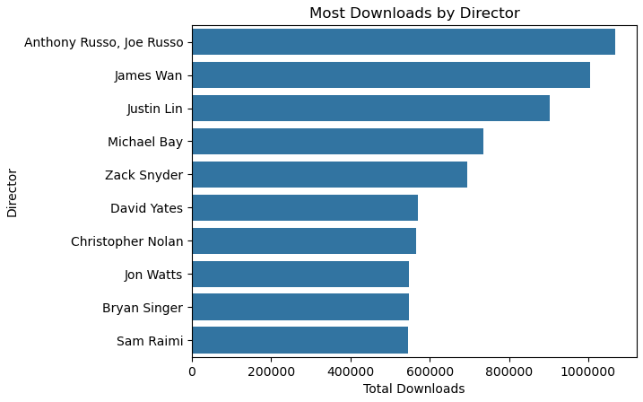
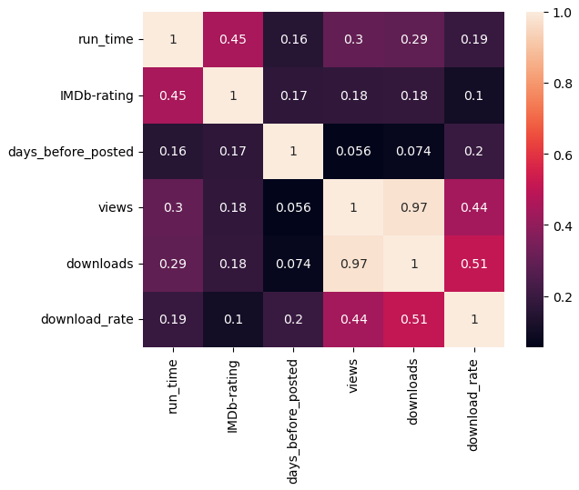
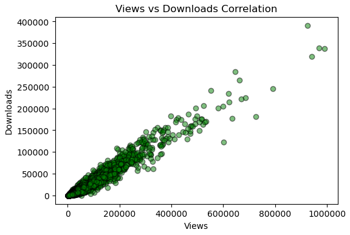
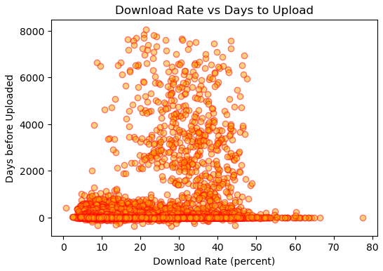
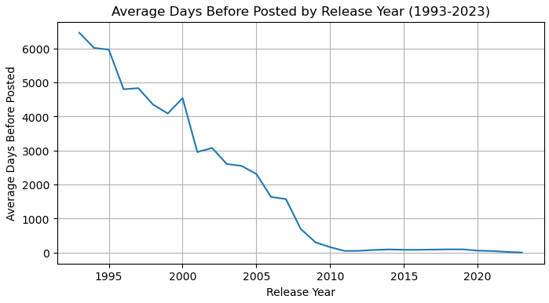
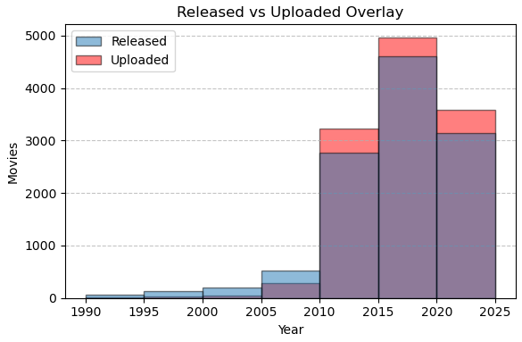

## Table of Contents
1. [**Project Overview**](https://github.com/baclausen/ddi-midterm?tab=readme-ov-file#overview)
2. [**Exploratory Focuses**](https://github.com/baclausen/ddi-midterm?tab=readme-ov-file#exploratory-focuses)
3. [**Cleaning**](https://github.com/baclausen/ddi-midterm?tab=readme-ov-file#cleaning)
4. [**Visual Aides**](https://github.com/baclausen/ddi-midterm?tab=readme-ov-file#visualization-of-data)
5. [**Conclusion**](https://github.com/baclausen/ddi-midterm?tab=readme-ov-file#conclusion)
6. [**Sources**](https://github.com/baclausen/ddi-midterm?tab=readme-ov-file#sources)

## Overview
Digital piracy in the United States is a persistent and costly issue, primarily impacting the film, TV, and music sectors. It costs the U.S. economy billions of dollars annually in lost revenue and contributes to substantial job losses, with illegal streaming now the dominant method of infringement. Despite the availability of numerous legal streaming platforms, high costs and content fragmentation are cited as reasons, particularly by younger consumers, who continue to drive unauthorized content consumption. The fight against piracy focuses on reinforcing intellectual property protections and coordinated global enforcement efforts.

This exploratory data analysis observes trends and/correlations in pirated video files to identify what categories of video content are the most susceptible.

## Exploratory Focuses
- How has piracy grown since inception?
- What correlations exist between the amount of time a file is posted, the number of downloads, download rate, and IMDb rating?

## Cleaning
The original dataset contained a lot of poorly formatted data. Nearly all values, to include dates, counts of views/downloads, runtimes were stored as strings with inconsistent formats.

1. **Initial Filtering**
   The data contained content derived from various parts of the world. I created and applied a mask onto the dataframe to view only content identified to have originated in the United States.

2. **Dropping the Dead Weight**
   There were a number of columns which were of no use or of which I had no interest for my exploration. I opted to drop these columns rather than correct any missing or erroneous data.

3. **Formatting**
   Numbers were converted from strings, dates were converted and given a uniform format, and uniform runtimes were derived from several varying formats.

4. **Removing Duplicates**
   Once everything was formatted nicely I removed duplicates by grouping on the *title, director, and release date* to ensure I wasn't removing an entry unnecessarily if different movies share the same name. I kept the instance with the highest download rate (duplicates are likely the result of several different uploads of the same movie).

5. **Filling the blanks**
   Columns with string variables were provided an instance of 'Not available' for null values. Missing numeric data was filled using the mean value of the available numeric values.

6. **Additional Engineering**
   New columns performing useful calculations were added before the entirety of the data was organized logically and sorted. Additional filters functions were created for analysis.

## Visualization of Data
  
A list of directors whose collective works have been downloaded the most.

  
A direct correlation with sheer number of downloads compared to views is apparent as a view must occur to initiate a download.
I was surprised the correlation between the download rate and IMDb rating was not stronger, as popular content would logically have a higher rate for piracy.
I had also anticipated a stronger relationship between the days between release/upload and the download rate to be higher. The concept of content available for piracy close to the release date being popular seems likely, but this could be skewed by data included before sites became mainstream.

  
Representation of the observation above showing a very strong logical connection between views and downloads.

  
The information to glean from this graph lies heavily on the right side - we see that higher download percentages do, in fact, correspond to fast uploading in many cases. The cluster in the middle likely represents content created before the popularity of digital piracy.

  
A line chart depicting the average amount of days between a release date and an upload date, categorized by year. The increase in the late 1990s coincides with the enactment of the Digital Millennium Copywrite Act, which outlined legal ramification of digital piracy. The chart flattens out near 2012, which is an *average* of near zero days between theatrical release and piracy and constitutes its dominance on the entertainment industry.

  
This overlay shows a surge in content available on the pirating site which indicates a huge uptick in adoption of illegal downloading. Aside from sheer volume, this is apparent when noting the number of videos posted surpassed US production, indicating that purveyors of pirated content were able to not onl keep pace with Hollywood, but access or digitize content from previous years.

## Conclusion
The reason for the large surge around 2010 isn't evident within the dataframe, but further research aligns with several contributing factors:  

1. **Technological Facilitation and Quality**  
Faster commercial internet speeds facilitate sharing of larger file sizes. Coupled with increases to quality via DVD and blu-ray popularity, a surge in illegally available content was logical.

2. **Fragmentation of Legal Content Access**   
The initial success of streaming in reducing piracy was reversed by the fragmentation of the market . The rise of numerous content-exclusive platforms forced users into paying for multiple costly subscriptions, making legal access inconvenient. This "service issue" led to a resurgence of piracy, which offered a simple, single, access point to all desired content.

3. **Delays and Availability Windows**  
The traditional studio practice of using staggered release "windows" for theaters, home video, and streaming was undermined by piracy, as a high-quality digital copy became immediately available to everyone. This problem was compounded by studios delaying international releases for months, which pushed global audiences to pirate content as soon as it became available in any region. In the digital age, piracy solved both the time delay and the geographic access problem for frustrated consumers.

## Sources  
The original data was sourced from Kaggle and uploaded by user Arsalan ur Rehman.  
The image in the header is AI generated from Google Gemini